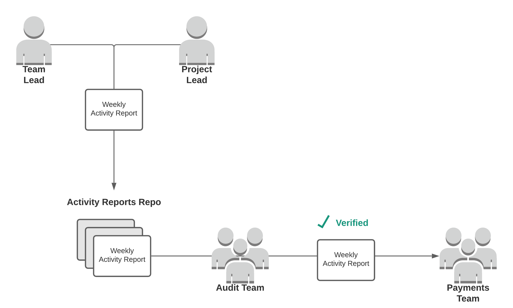

  

# Activity-Reports

Project leads and team leads are responsible for submitting a weekly activity report to the Audit Team by Friday at 
midnight (UTC) each week. Payments will be sent out after the reports have been verified by the Audit Team. This repo 
is where weekly activity reports are submitted and organized.

|S.no|Task|Responsible|Deadline|
|----|----|---|---|
|1|Report Submission|Team Leads|Friday by 23:59 (UTC)|
|2|Audit Reports|Auditors|Saturday by 23:59 (UTC)|
|3|Objection to Audit Summary|Team Leads + Members|Sunday by 11:59 (UTC)|
|4|Release Payments|Payments Team|Sunday by 23:59 (UTC)|

**Audit Team Responsibilities**
- review weekly activity reports
- ask for additional proof of work if needed
- verify activity reports and forward those to the Payments Team to be paid

**Weekly Activity Report Content**
- a list of all teammates who contributed that week
- a detailed overview of each teammate's contributions
- any additional proof of work (notes, documents, screenshots, GitHub links, etc...)

**Additional Notes**
- being on a team or project does not necessarily mean that all teammates will receive payments every week
- being on a team or project only indicates that an individual is *eligible* for weekly payments
- not all payments will be sent out on Sunday since there may be some additional back and forth required if the Audit Team has any further questions or additional proof of work is needed

**Audit Team**
- [Chrisha](https://github.com/Chrisha1212)
- [Chuy](https://github.com/javina89)
- [Justin](https://github.com/angle943)
- [Manish](https://github.com/manishram)

